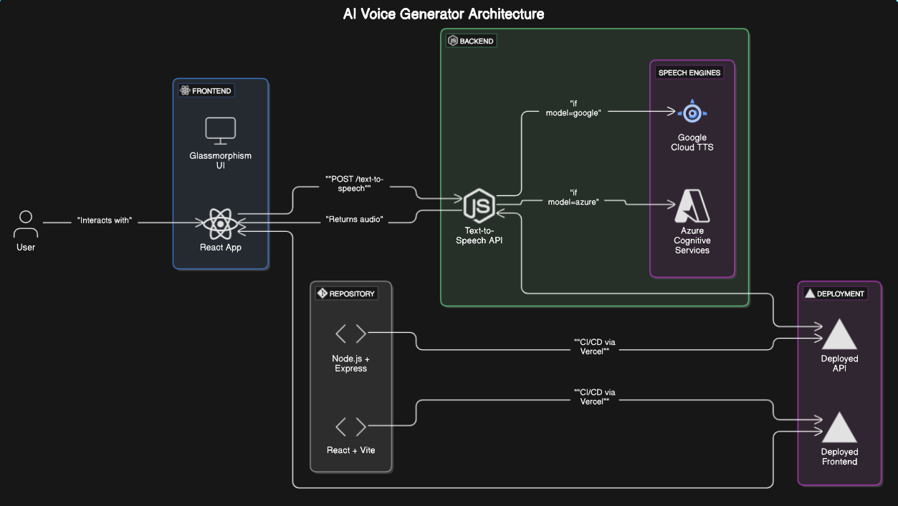
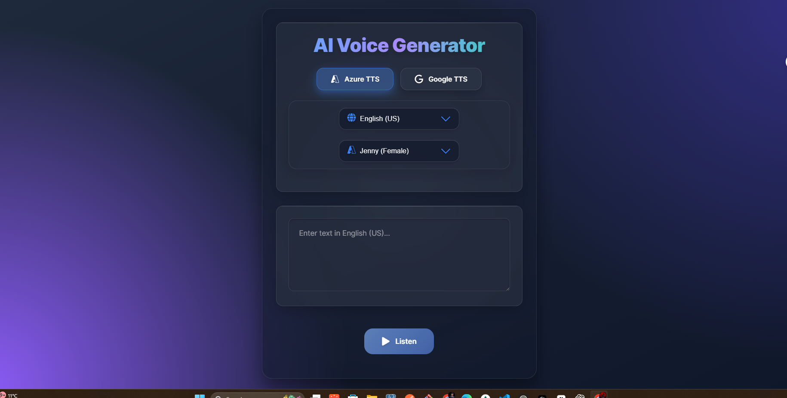

# AI Voice Generator

An advanced text-to-speech application that converts text to natural-sounding speech using multiple AI speech engines.

## High Level Design

---



---

## Frontend ui 

---



---

## Features

- 🎙️ Dual speech engines: Azure Cognitive Services and Google Cloud Text-to-Speech
- 🌐 Support for multiple languages (12+ languages including English, Spanish, French, etc.)
- 👨‍👩‍👧‍👦 Multiple voice options for each language and gender
- 🔊 High-quality neural voice synthesizing
- 💾 Download synthesized speech as MP3 files
- 🎨 Beautiful, responsive UI with glass-morphism design
- ✨ Interactive animations and visual feedback

## Tech Stack

### Frontend

- React 19
- Framer Motion (animations)
- React Icons
- Modern CSS with glassmorphism effects
- Vite (build tool)

### Backend

- Node.js
- Express
- Azure Speech SDK
- Google Cloud Text-to-Speech API

## Installation

### Prerequisites

- Node.js (v14 or later)
- npm or yarn
- Azure Cognitive Services account
- Google Cloud Platform account with Text-to-Speech API enabled

### Setup

1. Clone the repository

   ```bash
   git clone https://github.com/yourusername/ai-voice-generator.git
   cd ai-voice-generator
   ```

2. Install dependencies

   ```bash
   # Install frontend dependencies
   cd client
   npm install

   # Install backend dependencies
   cd ../server
   npm install
   ```

3. Create environment variables
   ```bash
   # In the server directory, create a .env file
   touch .env
   ```
   Add the following environment variables:
   ```
   AZURE_SPEECH_KEY=your_azure_key
   AZURE_SERVICE_REGION=your_azure_region
   GOOGLE_APPLICATION_CREDENTIALS=path_to_google_credentials.json
   PORT=5000
   ```

## Usage

### Starting the Application

1. Start the backend server

   ```bash
   cd server
   npm start
   ```

2. In a new terminal, start the frontend

   ```bash
   cd client
   npm run dev
   ```

3. Open your browser and navigate to `http://localhost:5173/`

### Converting Text to Speech

1. Type or paste your text in the input field
2. Select your preferred language
3. Choose a voice type (male/female)
4. Select the speech engine (Azure or Google)
5. Click the "Generate Speech" button
6. Use the player controls to listen to the generated speech
7. Click "Download" to save the audio as an MP3 file

## API Reference

### Backend Endpoints

#### Generate Speech

```
POST http://localhost/text-to-speech
```

Body:

```json
{
  "text": "Text to convert to speech",
  "language": "en-US",
  "voice": "en-US-GuyNeural",
  "engine": "azure"
}
```

#### Get Available Voices

```
GET /api/voices?engine=azure&language=en-US
```

## Configuration

### Azure Cognitive Services

1. Create an Azure account at [portal.azure.com](https://portal.azure.com)
2. Create a Speech Service resource
3. Copy the key and region to your .env file

### Google Cloud Text-to-Speech

1. Create a Google Cloud account at [console.cloud.google.com](https://console.cloud.google.com)
2. Enable the Text-to-Speech API
3. Create a service account and download the credentials JSON file
4. Set the path to this file in your .env

## Contributing

1. Fork the repository
2. Create a feature branch (`git checkout -b feature/amazing-feature`)
3. Commit your changes (`git commit -m 'Add some amazing feature'`)
4. Push to the branch (`git push origin feature/amazing-feature`)
5. Open a Pull Request

## Troubleshooting

### Common Issues

- **API Key errors**: Ensure your environment variables are correctly set
- **Voice not loading**: Check your internet connection and API quotas
- **Audio playback issues**: Try using a different browser

## License

This project is licensed under the MIT License - see the LICENSE file for details.

## Acknowledgments

- Azure Cognitive Services for their speech synthesis API
- Google Cloud for their Text-to-Speech technology
- The React community for the amazing frontend tools
